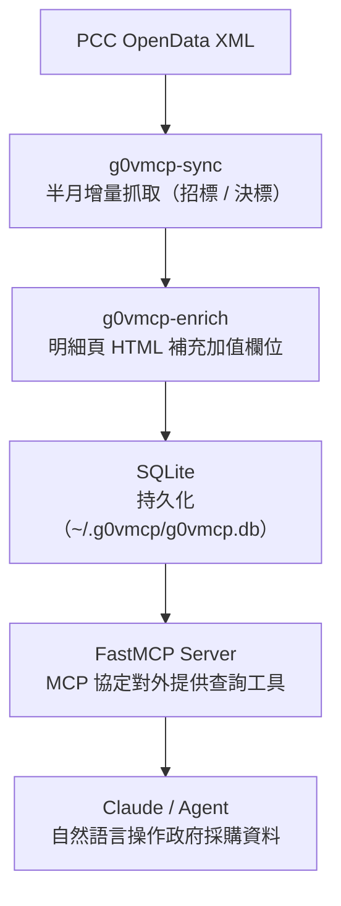

# g0VMCP

**用一句話問出台灣政府採購情報。** g0VMCP 是一個 Model Context Protocol（MCP）伺服器，聚合政府電子採購網（PCC）標案資料，讓 Claude 等 AI Agent 用自然語言查詢衛福部資訊服務類標案 — 包含公開資料集缺漏的預算、底價、投標家數等加值欄位。

> **English:** g0VMCP is an MCP server that aggregates Taiwan's Public Construction Commission (PCC) e-procurement data for Ministry of Health and Welfare (MOHW) IT-service tenders. It fills in the value-added fields missing from the public `pcc-tender` open dataset — budget, bid/award dates, reserve price, bidder count — and tracks each tender's full lifecycle from announcement through award. Built with [FastMCP](https://github.com/jlowin/fastmcp).

[](https://www.python.org/)
[](LICENSE)
[](https://github.com/jlowin/fastmcp)
[](https://github.com/trionnemesis/g0VMCP/actions/workflows/ci.yml)
[](https://github.com/trionnemesis/g0VMCP/stargazers)

📖 **[專案網站 / Docs](https://trionnemesis.github.io/g0VMCP/)** ・ 🐛 **[回報問題](https://github.com/trionnemesis/g0VMCP/issues/new/choose)** ・ 💬 **[討論區](https://github.com/trionnemesis/g0VMCP/discussions)**

---

## 這能做什麼？

裝好之後，直接問 Claude：

> 💬「衛福部最近三個月有哪些預算 500 萬以上、還在招標中的資訊服務案？」
>
> 💬「標案 `112-XXXX-01` 從公告到決標經過哪些更正？底價和決標金額差多少？」
>
> 💬「統編 12345678 這家廠商過去拿過哪些衛福部的案子？」

Claude 會透過 g0VMCP 的四個查詢工具（[`search_tenders`](#mcp-工具) / [`get_tender_detail`](#mcp-工具) / [`get_tender_lifecycle`](#mcp-工具) / [`get_vendor_awards`](#mcp-工具)）直接回答，不用再去採購網逐頁翻。

## 為什麼需要 g0VMCP？

政府電子採購網的公開資料（`pcc-tender` 資料集）有兩個痛點：

1. **加值欄位缺漏** — 預算金額、底價、投標家數、開標時間等關鍵欄位不在公開 XML 裡，只存在明細頁 HTML。
2. **生命週期斷裂** — 招標、更正、決標公告是分散的獨立記錄，難以追蹤單一標案的完整歷程。

g0VMCP 解決這兩件事：自動抓取明細頁補完欄位、以聚合根維護標案生命週期不變量，再透過 MCP 協定讓 AI Agent 直接消費這些資料。

---

## 目錄

- [功能概覽](#功能概覽)
- [資料來源與範圍](#資料來源與範圍)
- [快速開始](#快速開始)
- [MCP 工具](#mcp-工具)
- [CLI 資料管理指令](#cli-資料管理指令)
- [環境變數](#環境變數)
- [專案架構](#專案架構)
- [開發](#開發)
- [貢獻與社群](#貢獻與社群)
- [License](#license)
- [Related projects](#related-projects)

---

## 功能概覽

| 能力 | 說明 |
|------|------|
| **標案搜尋** | 關鍵字、機關、狀態、日期、金額多維篩選 |
| **標案明細** | 預算、開/截標時間、底價、投標家數、CPC 碼等加值欄位 |
| **生命週期時間線** | 招標 → 更正 → 決標完整事件序列 |
| **廠商得標查詢** | 以統編反查歷史得標記錄 |
| **自動同步** | CLI 半月增量抓取，Cloudflare 擋牆自動退避 |

---

## 資料來源與範圍

- **資料來源**：[政府電子採購網](https://web.pcc.gov.tw)（半月公開 XML + 明細頁 HTML）
- **機關範圍**：機關名稱以「衛生福利部」開頭的所有轄下單位
- **採購類別**：資訊服務類（CPC 碼前綴 `45` 計算機 / `84` 電腦服務 / `47` 通訊器材）
- **生命週期狀態**

| 狀態 | 說明 |
|------|------|
| `TENDERING` | 招標中，尚未決標 |
| `AMENDED` | 已發布更正公告 |
| `AWARDED` | 已決標 |
| `FAILED` | 無法決標 |
| `STALE` | 超過 180 天無決標，系統自動標記 |

---

## 快速開始

需要 Python 3.11+。

### 1. 安裝

> 尚未發佈至 PyPI，請直接從原始碼安裝。

```bash
# pip（直接由 GitHub 安裝）
pip install git+https://github.com/trionnemesis/g0VMCP.git

# 或 clone 後本地開發安裝
git clone https://github.com/trionnemesis/g0VMCP.git
cd g0VMCP
pip install -e .
```

### 2. 加入 Claude Code

```bash
claude mcp add g0vmcp -- g0vmcp
```

或手動編輯 `~/.claude/mcp.json`：

```json
{
  "mcpServers": {
    "g0vmcp": {
      "command": "g0vmcp"
    }
  }
}
```

使用 `uvx`（尚未發佈至 PyPI，需指定 git 來源）：

```json
{
  "mcpServers": {
    "g0vmcp": {
      "command": "uvx",
      "args": ["--from", "git+https://github.com/trionnemesis/g0VMCP.git", "g0vmcp"]
    }
  }
}
```

### 3. 灌入資料

安裝完成後 DB 為空，需執行一次完整同步：

```bash
# 抓取招標（近 3 月）與決標（近 24 月）
g0vmcp-sync

# 補明細頁加值欄位（每批 30 筆，被擋自動退避 4 小時）
g0vmcp-enrich

# 清除非衛福部 / 非資訊服務類資料（先 dry-run 預覽）
g0vmcp-purge
g0vmcp-purge --apply
```

---

## MCP 工具

### `search_tenders`

以多維條件查詢標案清單，回傳最多 200 筆摘要。

| 參數 | 型別 | 說明 |
|------|------|------|
| `keyword` | `str?` | 標案名稱關鍵字 |
| `domain_tag` | `str?` | 資訊服務分類標籤 |
| `agency` | `str?` | 機關名稱（部分比對） |
| `state` | `str?` | 生命週期狀態（見上表） |
| `budget_min` | `int?` | 預算下限（新臺幣元） |
| `budget_max` | `int?` | 預算上限（新臺幣元） |
| `date_from` | `date?` | 公告日期起 |
| `date_to` | `date?` | 公告日期迄 |
| `limit` | `int` | 回傳筆數（預設 50，最大 200） |

### `get_tender_detail`

以 `case_no` 取得標案完整明細，包含本系統補完的加值欄位（預算金額、開標時間、截止收件時間、底價、投標廠商數及標的分類碼）。

### `get_tender_lifecycle`

以 `case_no` 取得該標案所有公告事件的時間線（招標 → 更正 → 決標）。

### `get_vendor_awards`

以廠商統編查詢在本資料庫內的所有得標記錄。

---

## CLI 資料管理指令

### `g0vmcp-sync`

從 PCC 半月公開 XML 抓取招標與決標資料，增量寫入 SQLite。

```bash
g0vmcp-sync                             # 預設：招標 3 月、決標 24 月
g0vmcp-sync --tender-months 6 --award-months 36
g0vmcp-sync --db /data/pcc.db
```

### `g0vmcp-enrich`

對已入庫但缺加值欄位的標案，逐一抓取 PCC 明細頁補充 HTML 解析欄位。

```bash
g0vmcp-enrich                           # 每批 30 筆，被 Cloudflare 擋牆自動退避
g0vmcp-enrich --batch 50 --db /data/pcc.db
```

### `g0vmcp-purge`

刪除不符合「衛福部 × 資訊服務類」篩選條件的記錄。

```bash
g0vmcp-purge                            # dry-run，僅預覽刪除筆數
g0vmcp-purge --apply                    # 實際執行刪除
```

---

## 環境變數

| 變數 | 說明 | 預設值 |
|------|------|--------|
| `G0VMCP_DB` | SQLite DB 路徑 | `~/.g0vmcp/g0vmcp.db` |
| `G0VMCP_TRANSPORT` | MCP transport（`stdio` / `sse`） | `stdio` |
| `G0VMCP_HOST` | SSE bind host | `127.0.0.1` |
| `G0VMCP_PORT` | SSE port | `8000` |

SSE 模式適用於多 Agent 共用或容器部署：

```bash
G0VMCP_TRANSPORT=sse G0VMCP_PORT=9000 g0vmcp
```

---

## 專案架構

```
src/g0vmcp/
├── contracts.py          # 跨層 DTO、Enum、Protocol（DI 邊界）
├── cli.py                # CLI entry points（sync / enrich / purge）
├── domain/               # 標案聚合根、生命週期不變量、分類邏輯
├── ingestion/            # PCC HTTP 抓取、HTML 解析、Cloudflare 退避
├── repository/           # SQLite schema 與 Repository 實作
└── mcp_server/           # FastMCP tools 與查詢 Service（讀模型）

spec/
├── erm.dbml              # Entity-Relationship 領域模型
├── event-storming.md     # 事件風暴流程設計
└── features/             # Gherkin BDD 行為規格

tests/
├── domain/               # 聚合根與生命週期單元測試
├── ingestion/            # XML 解析與範圍判定單元測試
├── repository/           # SQLite 持久化整合測試
├── mcp/                  # MCP tools 行為測試
└── integration/          # 端對端流程測試
```

**資料流**



---

## 開發

```bash
git clone https://github.com/trionnemesis/g0VMCP.git
cd g0VMCP
python -m venv .venv
source .venv/bin/activate
pip install -e ".[dev]"

# 執行全部測試
python -m pytest

# 指定本地 DB 路徑啟動 MCP server
G0VMCP_DB=./dev.db python -m g0vmcp.mcp_server
```

---

## 貢獻與社群

歡迎任何形式的參與 — 不一定要寫程式：

- 🐛 **發現資料錯誤或 bug** → [開一個 Issue](https://github.com/trionnemesis/g0VMCP/issues/new/choose)（有模板，照著填就好）
- 💡 **想要新功能**（例如擴大機關範圍、新查詢維度）→ 用 Feature Request 模板許願
- 💬 **使用問題、心得交流** → [Discussions](https://github.com/trionnemesis/g0VMCP/discussions)
- 🔧 **想改 code** → fork 後開 PR，記得先跑 `python -m pytest`

如果這個專案對你有幫助，請給一顆 ⭐ — 這是讓更多人看見台灣開放資料工具最簡單的方式。

---

## License

[MIT](LICENSE)

---

## Related projects

- [healthcare-opendata-mcp](https://github.com/trionnemesis/healthcare-opendata-mcp) — 健保署開放資料 × 政府採購標案（全機關）MCP，涵蓋 `pcc-tender` 全資料集與健保開放資料查詢；g0VMCP 為其衛福部資訊服務類子集的加值深化版本。

---

*資料來源：[政府電子採購網](https://web.pcc.gov.tw)（公開資料，依政府資料開放授權條款使用）*
