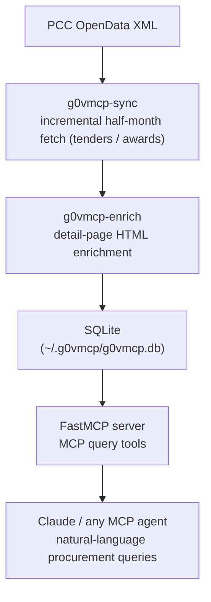

# g0VMCP

[](https://github.com/trionnemesis/g0VMCP/actions/workflows/ci.yml)
[](https://www.python.org/)
[](LICENSE)
[](https://github.com/jlowin/fastmcp)
[](https://github.com/trionnemesis/g0VMCP/stargazers)

> g0VMCP is a Model Context Protocol (MCP) server for Taiwan government procurement intelligence. It aggregates Public Construction Commission (PCC) e-procurement data for Ministry of Health and Welfare (MOHW) IT-service tenders, fills in the value-added fields missing from the public open dataset — budget, bid/award dates, reserve price, bidder count — and lets Claude or any MCP-compatible agent answer procurement questions in natural language.

**繁體中文說明請見 [README.zh-TW.md](README.zh-TW.md)** ・ 📖 [Website](https://trionnemesis.github.io/g0VMCP/) ・ 🐛 [Issues](https://github.com/trionnemesis/g0VMCP/issues/new/choose) ・ 💬 [Discussions](https://github.com/trionnemesis/g0VMCP/discussions)

Jump to: [Why](#why) ・ [What it does](#what-it-does) ・ [How it works](#how-it-works) ・ [Quick start](#quick-start) ・ [MCP tools](#mcp-tools) ・ [Contributing](#contributing)

---

## Why

Taiwan's e-procurement portal publishes open data (`pcc-tender`), but two gaps make it hard to use:

1. **Missing value-added fields** — budget, reserve price, bidder count, and opening dates only exist on detail pages (HTML), not in the public XML feeds.
2. **Fragmented lifecycle** — tender, amendment, and award announcements are separate records; there is no single view of one tender's history.

g0VMCP closes both gaps: it enriches records from detail pages, maintains lifecycle invariants with a tender aggregate, and exposes the result through MCP so an AI agent can consume it directly.

Once installed, just ask Claude:

> 💬 "Which MOHW IT-service tenders over NT$5M are still open in the last three months?"
>
> 💬 "Show the full timeline of tender `112-XXXX-01` — how far apart were the reserve price and the award amount?"
>
> 💬 "What has vendor tax-ID 12345678 won from MOHW before?"

## What it does

| Capability | Description |
|------------|-------------|
| **Tender search** | Multi-dimensional filters: keyword, agency, state, dates, budget range |
| **Tender detail** | Enriched fields: budget, open/close dates, reserve price, bidder count, CPC codes |
| **Lifecycle timeline** | Complete event sequence: announcement → amendment → award |
| **Vendor awards** | Reverse lookup of award history by vendor tax ID |
| **Auto sync** | Incremental half-month CLI fetches with automatic Cloudflare backoff |

**Data scope**

- **Source**: [Taiwan government e-procurement portal](https://web.pcc.gov.tw) (half-month public XML + detail-page HTML)
- **Agencies**: all units whose name starts with 衛生福利部 (Ministry of Health and Welfare)
- **Category**: IT services (CPC prefixes `45` computing / `84` computer services / `47` telecom equipment)

| Lifecycle state | Meaning |
|------|------|
| `TENDERING` | Open, not yet awarded |
| `AMENDED` | Amendment announcement published |
| `AWARDED` | Awarded |
| `FAILED` | Failed to award |
| `STALE` | No award after 180 days, auto-flagged |

## How it works



The codebase separates domain logic (tender aggregate, lifecycle invariants, classification), ingestion (HTTP fetch, HTML parsing, Cloudflare backoff), SQLite persistence, and the FastMCP server — see [Architecture](#architecture).

## Quick start

Requires Python 3.11+.

### 1. Install

> Not yet published to PyPI — install from source.

```bash
# pip (directly from GitHub)
pip install git+https://github.com/trionnemesis/g0VMCP.git

# or clone for local development
git clone https://github.com/trionnemesis/g0VMCP.git
cd g0VMCP
pip install -e .
```

### 2. Add to Claude Code

```bash
claude mcp add g0vmcp -- g0vmcp
```

Or edit `~/.claude/mcp.json` manually:

```json
{
  "mcpServers": {
    "g0vmcp": {
      "command": "g0vmcp"
    }
  }
}
```

With `uvx` (git source required until the PyPI release):

```json
{
  "mcpServers": {
    "g0vmcp": {
      "command": "uvx",
      "args": ["--from", "git+https://github.com/trionnemesis/g0VMCP.git", "g0vmcp"]
    }
  }
}
```

### 3. Populate the database

The DB is empty after install — run one full sync:

```bash
# fetch tenders (last 3 months) and awards (last 24 months)
g0vmcp-sync

# enrich value-added fields from detail pages (batches of 30, 4h backoff when blocked)
g0vmcp-enrich

# purge out-of-scope records (dry-run first)
g0vmcp-purge
g0vmcp-purge --apply
```

## MCP tools

### `search_tenders`

Multi-dimensional tender search, returning up to 200 summaries.

| Parameter | Type | Description |
|------|------|------|
| `keyword` | `str?` | Tender-title keyword |
| `domain_tag` | `str?` | IT-service classification tag |
| `agency` | `str?` | Agency name (partial match) |
| `state` | `str?` | Lifecycle state (see table above) |
| `budget_min` | `int?` | Budget floor (TWD) |
| `budget_max` | `int?` | Budget ceiling (TWD) |
| `date_from` | `date?` | Announcement date from |
| `date_to` | `date?` | Announcement date to |
| `limit` | `int` | Result count (default 50, max 200) |

### `get_tender_detail`

Full detail for a `case_no`, including enriched fields (budget, opening time, submission deadline, reserve price, bidder count, CPC codes).

### `get_tender_lifecycle`

Timeline of every announcement event for a `case_no` (tender → amendment → award).

### `get_vendor_awards`

All award records in the database for a vendor tax ID.

## CLI data management

| Command | Purpose | Common flags |
|---------|---------|--------------|
| `g0vmcp-sync` | Incremental fetch of tenders/awards from half-month XML into SQLite | `--tender-months 6 --award-months 36`, `--db /data/pcc.db` |
| `g0vmcp-enrich` | Fetch detail pages to fill missing enriched fields | `--batch 50`, `--db /data/pcc.db` |
| `g0vmcp-purge` | Delete records outside the MOHW × IT-service scope | dry-run by default; `--apply` to execute |

## Environment variables

| Variable | Description | Default |
|------|------|--------|
| `G0VMCP_DB` | SQLite DB path | `~/.g0vmcp/g0vmcp.db` |
| `G0VMCP_TRANSPORT` | MCP transport (`stdio` / `sse`) | `stdio` |
| `G0VMCP_HOST` | SSE bind host | `127.0.0.1` |
| `G0VMCP_PORT` | SSE port | `8000` |

SSE mode suits multi-agent sharing or container deployment:

```bash
G0VMCP_TRANSPORT=sse G0VMCP_PORT=9000 g0vmcp
```

## Architecture

```
src/g0vmcp/
├── contracts.py          # cross-layer DTOs, enums, protocols (DI boundary)
├── cli.py                # CLI entry points (sync / enrich / purge)
├── domain/               # tender aggregate, lifecycle invariants, classification
├── ingestion/            # PCC HTTP fetch, HTML parsing, Cloudflare backoff
├── repository/           # SQLite schema and repository implementation
└── mcp_server/           # FastMCP tools and query service (read model)

spec/
├── erm.dbml              # entity-relationship domain model
├── event-storming.md     # event-storming process design
└── features/             # Gherkin BDD specs

tests/
├── domain/               # aggregate and lifecycle unit tests
├── ingestion/            # XML parsing and scope unit tests
├── repository/           # SQLite persistence integration tests
├── mcp/                  # MCP tool behavior tests
└── integration/          # end-to-end tests
```

## Development

```bash
git clone https://github.com/trionnemesis/g0VMCP.git
cd g0VMCP
python -m venv .venv
source .venv/bin/activate
pip install -e ".[dev]"

# run the full test suite
python -m pytest

# run the MCP server against a local DB
G0VMCP_DB=./dev.db python -m g0vmcp.mcp_server
```

## Trust and data use

- All data comes from the [public e-procurement portal](https://web.pcc.gov.tw) and is used under the Taiwan Open Government Data License.
- The server is read-only over a local SQLite copy — no credentials, no writes to any government system.
- Enrichment fetches respect rate limits with automatic backoff; no scraping evasion beyond polite retry pacing.

## Contributing

All forms of participation are welcome — you don't have to write code:

- 🐛 **Bug or data error** → [open an issue](https://github.com/trionnemesis/g0VMCP/issues/new/choose) (templates provided)
- 💡 **Feature idea** (wider agency scope, new query dimensions) → Feature Request template
- 💬 **Questions and show-and-tell** → [Discussions](https://github.com/trionnemesis/g0VMCP/discussions)
- 🔧 **Code** → fork and open a PR; run `python -m pytest` first

If this project helps you, a ⭐ is the easiest way to help others find Taiwan open-data tooling.

## License

[MIT](LICENSE)

## Related projects

- [healthcare-opendata-mcp](https://github.com/trionnemesis/healthcare-opendata-mcp) — NHI open data × government procurement (all agencies) MCP covering the full `pcc-tender` dataset; g0VMCP is its enriched, MOHW × IT-service deep-dive companion.

---

*Data source: [Taiwan government e-procurement portal](https://web.pcc.gov.tw), used under the Open Government Data License.*
