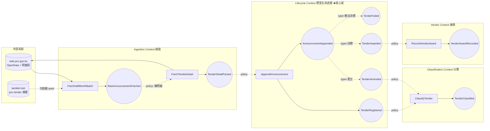

# 事件風暴地圖 — g0VMCP 政府採購標案情報聚合

> 領域:**Tender Intelligence Aggregation(標案情報聚合)**
> 本系統不是「採購業務系統」,而是「採購公告資料的擷取 → 整編 → 分類 → 查詢」平台。
> 因此領域事件分兩類:**映射真實世界採購事件** 與 **系統自身整編事件**。

---

## 0. 為什麼需要這個系統(需求根因)

twinkle-hub `pcc-tender` 只吃官方半月 OpenData 摘要(21 欄),實證缺:
**預算/公告金額、開標時間、截止投標日、標的細分類碼、投標廠商家數、底價、附件**;
且 `detail_url`/`agency_id` 全 162,189 筆皆空 → 無法當「發現層→明細層」的橋。
本系統(B 方案)自架擷取後端,動態下載 `web.pcc.gov.tw` 半月公開資料 XML,
再抓明細頁補完這些欄位,並用**官方標的分類 CPC 碼**(45/84/47=資訊服務)做乾淨
分類(取代標題 ILIKE 的雜訊)。範圍聚焦**衛生福利部及轄下機關 ∩ 資訊服務類**,
半月 XML 無分類碼故採兩階段:baseline 關鍵字初篩暫定 → 明細頁 CPC 碼精確確認。

---

## 1. Big Picture(時間軸:一個標案的一生)

---

## 2. 領域事件清單(過去式;橘色貼紙)

| 事件 | Context | 觸發者 | 攜帶資料(payload) | 不變量/備註 |
|---|---|---|---|---|
| `RawAnnouncementFetched` | Ingestion | 半月批次/seed | job_number, agency, announcement_type, date | 僅摘要層,等同 pcc-tender 既有欄位 |
| `TenderDetailParsed` | Ingestion | 明細爬蟲 | + budget(預算), bid_deadline(截標), open_date(開標), category_code(標的分類碼), bidder_count, base_price, attachments | **本系統存在的理由**:補齊摘要缺的欄位 |
| `TenderRegistered` | Lifecycle | AppendAnnouncement(首見案號) | tender_id=(org_id, job_number) | 同一 (org_id,job_number) 全域唯一 |
| `AnnouncementAppended` | Lifecycle | AppendAnnouncement | announcement(type,date,seq,payload) | 公告依 date 排序;(tender,seq,type) 不重複 |
| `TenderAmended` | Lifecycle | 附加更正公告 | amend_reason, diff | 更正不可早於招標公告 |
| `TenderAwarded` | Lifecycle | 附加決標公告 | award_price, vendors[] | **終局之一**:一旦決標,state=AWARDED |
| `TenderFailed` | Lifecycle | 附加無法決標公告 | fail_reason | **終局之一**:state=FAILED |
| `TenderClassified` | Classification | ClassifyTender | category_code, domain_tag(IT/工程/醫療…), method | 以官方分類碼為準,LLM 僅補邊界 |
| `VendorAwardRecorded` | Vendor | RecordVendorAward | vendor_tax_id, tender_id, award_price | 廠商以統編識別 |

---

## 3. 命令(Commands;藍色貼紙)→ 聚合 → 事件

| 命令 | 目標聚合 | 產生事件 | 前置條件 |
|---|---|---|---|
| `FetchHalfMonthBatch(period)` | — (擷取服務) | RawAnnouncementFetched* | 合法 OpenData 管道 |
| `FetchTenderDetail(caseNo)` | — (擷取服務) | TenderDetailParsed | 需 org_id 反查;rate-limit 節制 |
| `AppendAnnouncement(ann)` | **Tender** | TenderRegistered / AnnouncementAppended / TenderAmended / TenderAwarded / TenderFailed | 案號+seq 不可重複 |
| `ClassifyTender(tender_id)` | **Tender** | TenderClassified | 已有 category_code |
| `RecordVendorAward(...)` | **Vendor** | VendorAwardRecorded | 來源為決標公告 |

---

## 4. 政策 / 反應(Policies;紫色貼紙)

> 「當 X 發生,就 Y」——這是 context 之間的解耦黏著劑(event-driven)。

1. **當** `RawAnnouncementFetched` **則** `FetchTenderDetail`(補明細層)
2. **當** `TenderDetailParsed` **則** `AppendAnnouncement`(進生命週期)
3. **當** `AnnouncementAppended(type=決標)` **則** `RecordVendorAward`
4. **當** `TenderRegistered` 或 `TenderAmended` **則** `ClassifyTender`
5. **當** 半月 OpenData 新釋出 **則** diff 出新案號 → `FetchHalfMonthBatch`(增量更新)
6. **當** baseline 落庫前 **則** scope 過濾(機關非衛福部 / 標題黑名單 → 剔除;通過者暫定 IT、待 CPC 確認)
7. **當** `TenderClassified` 且 CPC 碼非資訊服務(非 45/84/47) **則** 標記範圍外(待 purge 剔除)
8. **當** TENDERING 逾 180 天無決標 **則** 標記 STALE(時間驅動維運,mark_stale)

---

## 5. 讀模型(Read Models;綠色貼紙)→ 對應 MCP tool

| 讀模型 | MCP tool | 餵養來源 |
|---|---|---|
| `TenderSearchView` | `search_tenders(關鍵字, 分類碼, 機關, 日期, 金額區間)` | Tender + Classification |
| `TenderDetailView` | `get_tender_detail(case_no)` | Tender 完整明細(預算/開標/分類/附件) |
| `TenderLifecycleView` | `get_tender_lifecycle(case_no)` | Announcement 事件流(招標→更正→決標時間線) |
| `VendorAwardsView` | `get_vendor_awards(vendor/統編)` | Vendor 聚合 |

---

## 6. 限界上下文(Bounded Contexts)與三條實作任務對應

| BC | 職責 | 對應實作任務 |
|---|---|---|
| **Ingestion** | 抓 OpenData + 明細頁解析,繞 Cloudflare(自抓非打 ronny 線上) | **任務① 擷取層** |
| **Lifecycle**(核心域) + **Classification** + **Vendor** | 聚合根、狀態機、分類、Repository、儲存 | **任務② 領域+儲存層** |
| **Query / MCP** | 對外 4 個 tool,讀模型投影 | **任務③ MCP 介面層** |

> 三任務的契約由 `spec/erm.dbml`(聚合結構)與 `spec/features/*.feature`(行為)鎖定,故可平行開發。
